# Accessing IBM Granite LLM via Ollama

This document explores how to access the IBM Granite model using Ollama. Let's demonstrate this process using both Jupyter Notebook and a Python script.

## 1. Setup Ollama

Ollama is a tool designed to run and interact with large language models (LLMs) locally on your computer, rather than in the cloud. It provides a streamlined interface for deploying and managing models like IBM Granite or other compatible LLMs directly on local hardware.

1. Download and install Ollama app in your system by using the URL https://ollama.com/download

2. Start the Ollama app by using the below command

```
ollama serve
```

3. Download any Granite model into your system.

```
ollama pull granite3-dense:2b
```

4. Verify the downloaded model by using the below command.
```
ollama list
```

You should get the below output.

```
NAME             	ID          	SIZE  	MODIFIED
granite3-dense:2b	a9c7deef7ab8	1.6 GB	2 hours ago
```

5. You can also pull few other models as well.

```
ollama pull granite3-dense:8b
ollama pull granite-code:3b
ollama pull granite-code:8b
ollama pull granite-code:20b
```

Ollama is now ready to serve content from the downloaded LLM models.


## 2. Setup JupyterLab

Need to install the JupyterLab. It is always good to  install JupyterLab in an Python Virtual environment.


1. Goto a folder where you want to install JupyterLab

ex: 
```
cd /Users/gandhi/GandhiMain/998-work
```

2. Create a virtual environment `my-jupyter-env` and activate it by using the below command

```
python -m venv my-jupyter-env
source my-jupyter-env/bin/activate

```

2. Install jupyterlab using the below command
```
pip install jupyterlab 
```

3. Run jupyterlab using the below command

```
jupyter lab 
```
 
4. JupyterLab would get started and open up in a new browser window in the URL http://localhost:8888/lab/workspaces/auto-U

It should show the Navigator window.

## 3. Create Jupyter Notebook with Python script

Let's create a Jupyter Notebook with Python script to access IBM Granite model.

1. Click on the + button in the top.

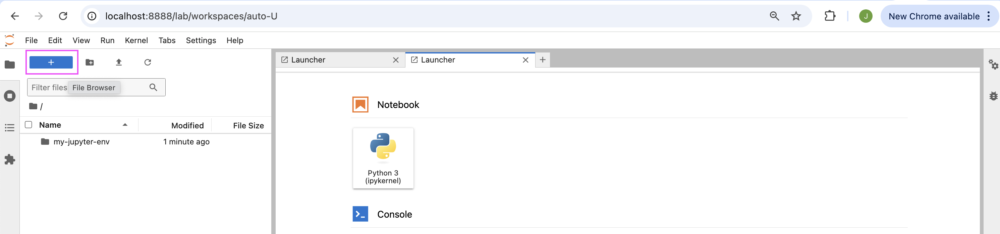

2. Choose the `Notebook` tile  `Python 3 (ipykernel)` in the navigator window.

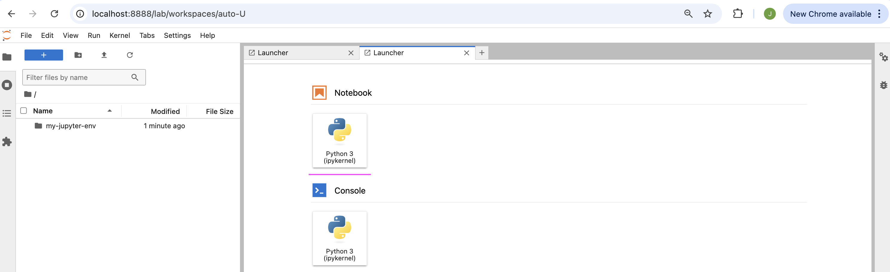

3. Click on the `Save` button to save the notebook.

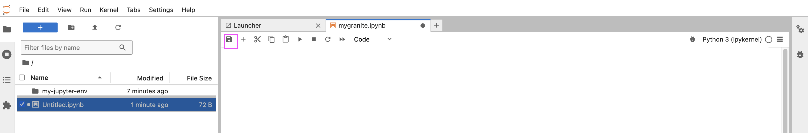

4. Enter the name.
5. Click `Rename` button

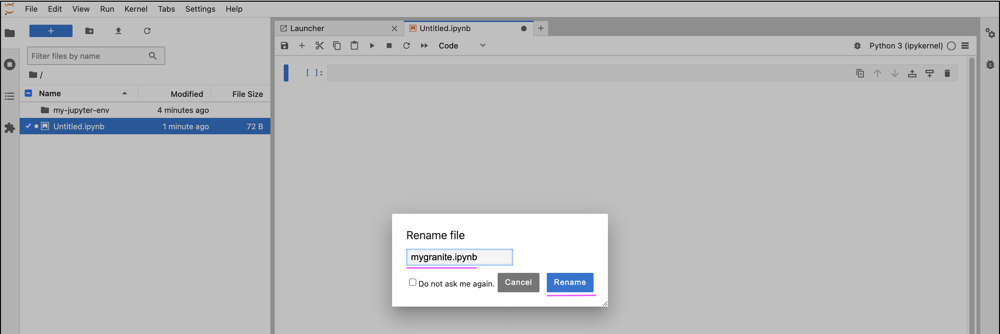

The notebook is saved in the given name.

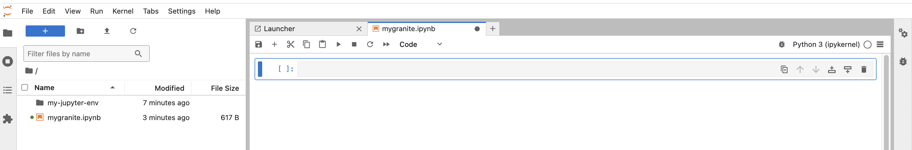

6. Copy the below content in the first cell.
```
!pip install langchain-ollama
```
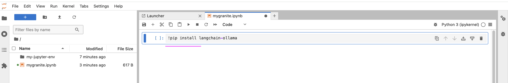

7. Click on + button in the Notebook 

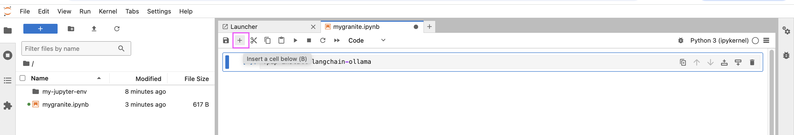

you get the second cell.

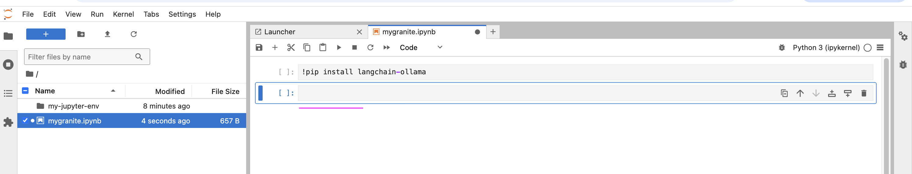


8. Copy the below content in the second cell.

```
model_id = "granite3-dense:2b"
```

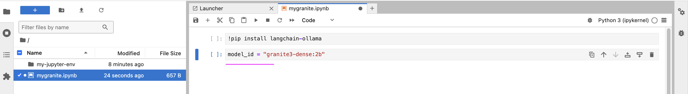

6. Click on + button in the Notebook and copy the below content in the third cell.
```
from langchain_ollama.llms import OllamaLLM

model = OllamaLLM(model=model_id)

```
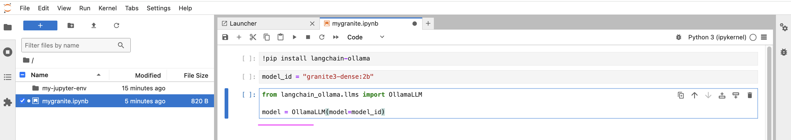


7. Click on + button in the Notebook and copy the below content in the cell.
```
prompt = "What is Kubernetes"

response = model.invoke(prompt)
print(response)
```

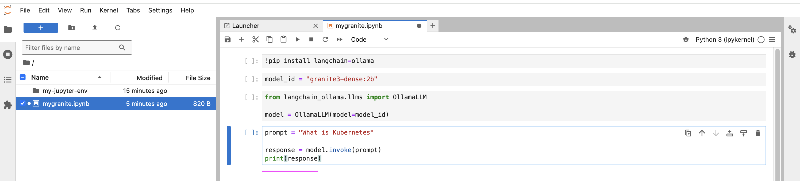

The Notebook is created and lets run the notebook in the next section.

## 4. Create Jupyter Notebook with Python script

Let's execute the notebook.

1. Ensure the kernel is pointing to `Python 3 (ipykernel)` in the top right corner.

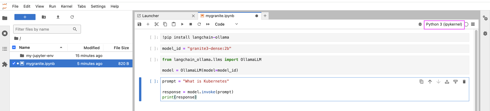

2. Place the cursor in the first cell 

3. Click on the `Run the cell and advance` button.

This would install the `langchain-ollama`

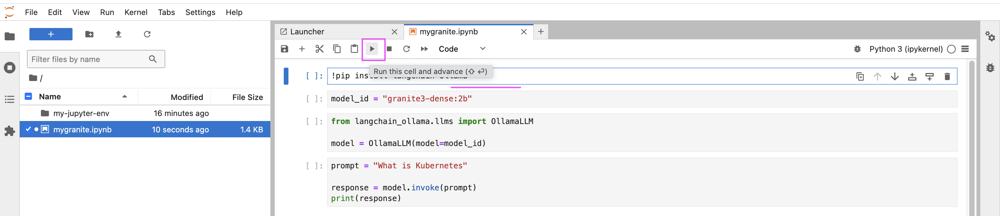

Here is the output of that.

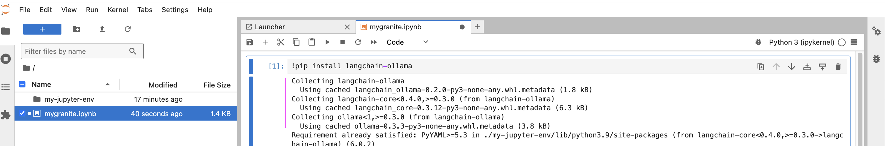

4. Similarly run the second cell.

This will choose the model_id 


5. Run the third cell.

This will create model object instance.

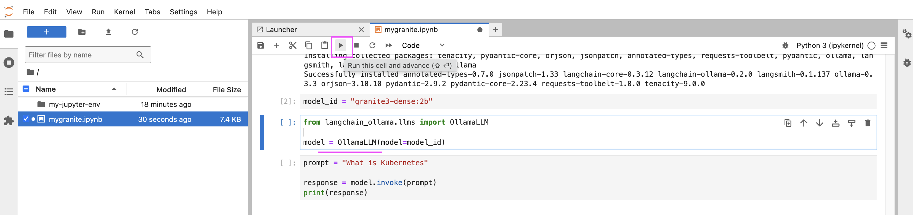

6. Run the fourth cell.

This will call the IBM Granite model and print the response.

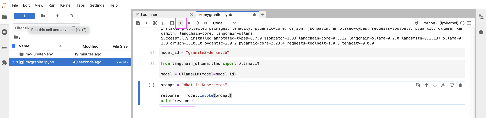

We have successfully execute the notebook by calling the IBM Granite model via the ollama.

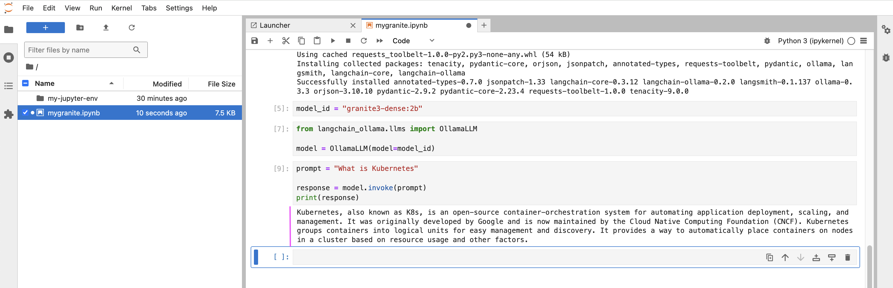


## 5. Sample Notebook

The same script is available as a sample notebook along with markup document [here](../files/sample.ipynb). You can copy and paste the notebook/content and execute it.

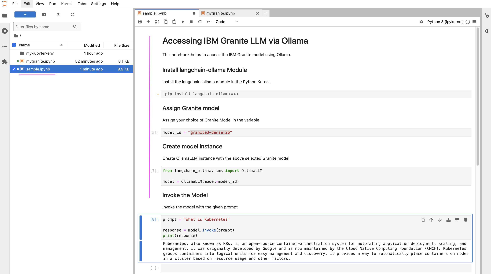


## 6. Closing the Apps

Once everything is completed. you can close the environment by following the steps here.

### 6.1 Close JupyterLab

1. You can close the window by choosing `File > Shutdown` option from the menu.

    
or 
    Press `Ctrl + C` keys to stop the JupyterLab from the terminal window.

### 6.2 Deactivate Virtual Environment

1. Run the below command to deactivate the virtual environment.

```
deactivate
```

### 6.3 Stop Ollama

1. Goto the terminal window, where your Ollama is running and press `Ctrl + C`

OR 

2. Run the below command to know the PID of the Ollama app.

```
ps aux | grep ollama
```

3. Run the below command to kill the Ollama app. process.

```
kill -9 <PID>
```


